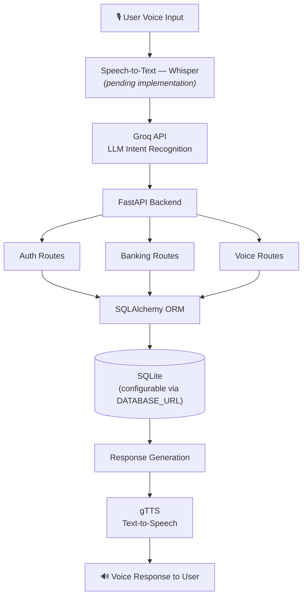
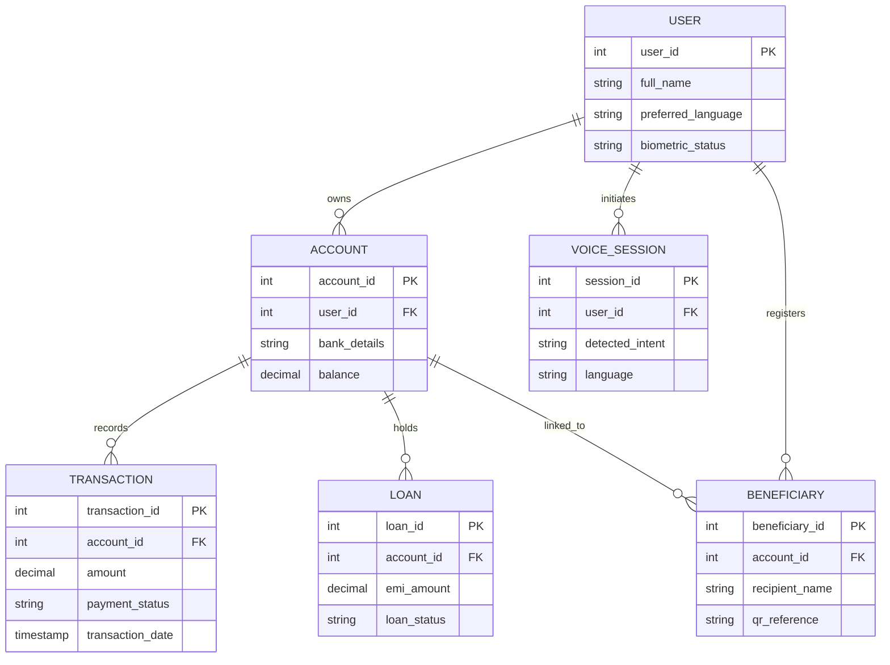
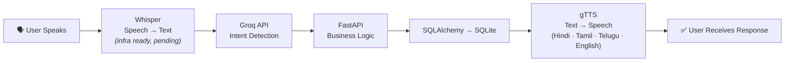
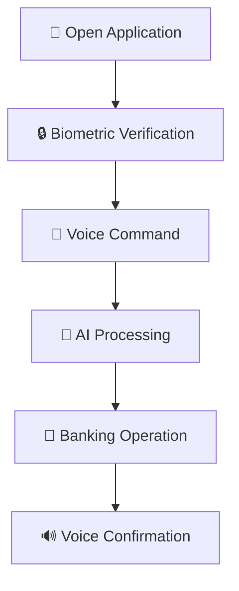

# 🎙️ FinVoice AI
### 💳 Voice-First Banking for Inclusive Financial Access

*Making digital banking accessible through voice, AI, and inclusive design.*

---

## 📖 Overview

**FinVoice AI** is an AI-powered, multilingual banking assistant built for people digital banking traditionally leaves behind:

| 👥 Target User | Why They're Underserved |
|---|---|
| 🌾 Rural users | Limited exposure to app-based banking UX |
| 👵 Elderly citizens | Small text, complex menus, unfamiliar navigation |
| 👨‍🦯 Visually impaired users | Screen-heavy interfaces with poor accessibility |
| 📖 Low-literacy users | Reading/typing is a hard barrier, not a minor one |
| 📱 First-time smartphone users | No prior mental model of app navigation |

Instead of navigating menus, forms, and small buttons, users simply **speak** their banking request in their preferred language and receive a **spoken** response back.

---

## 🎯 Problem Statement

Traditional banking apps assume a level of literacy, dexterity, and digital familiarity that a large share of Indian users don't have — which quietly locks them out of digital financial inclusion.

| ❌ Barrier in Existing Apps | ✅ How FinVoice AI Solves It |
|---|---|
| Requires reading | Fully voice-driven interaction, no reading needed |
| Requires typing | Speak commands naturally instead of typing |
| Complex, multi-step navigation | Single conversational flow powered by intent detection |
| Password management | Biometric authentication (fingerprint, face — planned) |
| English/limited language support | Native support for Tamil, Hindi, Telugu, and English |
| No feedback on errors | Voice confirmation at every step of a transaction |

---

## 🚀 Key Features

- **🎤 Voice Banking** — balance enquiry, fund transfer, loan status, transaction history, voice-driven navigation
- **🌍 Multilingual Support** — Tamil · Hindi · Telugu · English
- **🤖 AI-Powered Assistance** — natural language understanding, intent detection, context-aware, conversational
- **🔒 Secure Authentication** — fingerprint verification, transaction confirmation, beneficiary verification, face authentication (planned)
- **♿ Accessibility-Focused Design** — large UI components, voice navigation, screen-reader friendly, high-contrast support

**Architecture highlights:**
- Voice-first banking assistant designed specifically for unbanked and underserved users
- Full audio processing pipeline: speech → text → AI response → audio
- RESTful API with three main route modules: `auth`, `banking`, `voice`
- Frontend (Vite dev server on `localhost:5173`) connects to the backend via CORS

---

## 🏗️ Architecture

---

## 🗄️ Database Schema

| Module | Stores |
|---|---|
| 👤 **User** | Personal details, preferred language, biometric status |
| 💳 **Account** | Account info, balance, bank details |
| 💸 **Transactions** | Transfer records, payment status, transaction history |
| 🏦 **Loans** | Loan details, EMI information, loan status |
| 🎙️ **Voice Sessions** | User voice commands, detected intent, language |
| 👥 **Beneficiaries** | Trusted recipients, QR-based registrations |

---

## 🧠 AI Workflow

---

## 🛠️ Tech Stack

### Frontend

| Technology | Version | Purpose |
|---|---|---|
| React | 19.2.6 | UI framework |
| Vite | 8.0.12 | Build tool & dev server |
| React Router DOM | 7.17.0 | Client-side routing |
| Tailwind CSS | 4.3.0 | Styling framework |
| Framer Motion | 12.40.0 | Animations |
| Lucide React | 1.17.0 | Icon library |
| Axios | 1.17.0 | HTTP client |
| ESLint | 10.3.0 | Code linting |

### Backend

| Technology | Purpose |
|---|---|
| FastAPI | Async Python web framework |
| SQLAlchemy | ORM (Object-Relational Mapping) |
| SQLite | Default database (configurable via `DATABASE_URL`) |
| Python-dotenv | Environment variable management |
| CORS Middleware | Cross-Origin Resource Sharing |

### External AI/ML Services

| Service | Purpose |
|---|---|
| Groq API | LLM integration for AI banking assistant responses |
| gTTS (Google Text-to-Speech) | Audio generation in Hindi, Tamil, Telugu, English |
| Whisper | Speech-to-text — infrastructure in place, implementation pending |

---

## 🎨 User Flow

---

## 📈 Future Enhancements

- [ ] UPI Integration
- [ ] Voice Biometrics
- [ ] Offline Speech Recognition
- [ ] AI Fraud Detection
- [ ] WhatsApp Voice Banking
- [ ] Multi-Bank Aggregation
- [ ] Regional Dialect Support

---

## ⭐ Project Vision

*"Making Digital Banking Accessible Through Voice, AI, and Inclusive Design."*

