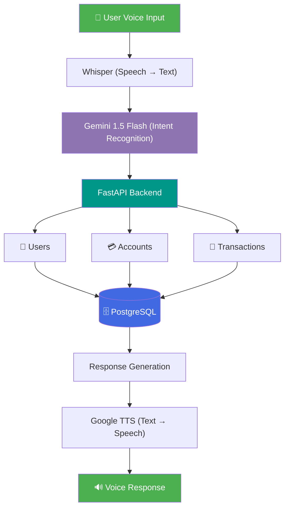
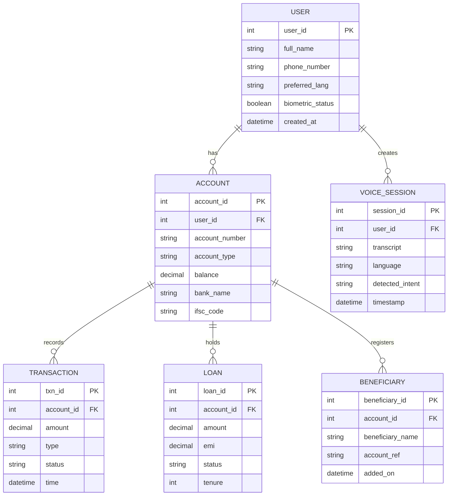
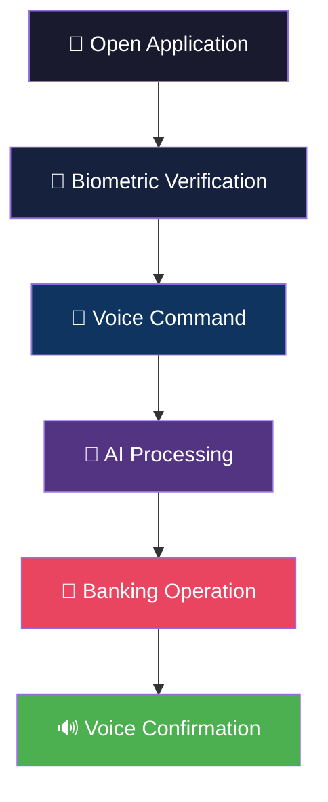

# 🎙️ FinVoice AI

### 💳 Voice-First Banking for Inclusive Financial Access

---

## 🌟 Project Overview

**FinVoice AI** is an AI-powered multilingual banking assistant designed for:

- 🌾 **Rural Users**
- 👵 **Elderly Citizens**
- 👨‍🦯 **Visually Impaired Users**
- 📖 **Low-Literacy Users**
- 📱 **First-Time Smartphone Users**

Instead of navigating complex banking applications, users can simply **speak their banking requests** in their preferred language and receive **voice-based responses**.

---

## 🎯 Problem Statement

Traditional banking applications rely heavily on:

| Barrier | Impact |
|---------|--------|
| ❌ Reading | Excludes low-literacy users |
| ❌ Typing | Difficult for elderly & visually impaired |
| ❌ Complex Navigation | Overwhelming for first-time users |
| ❌ Password Management | Security vs. accessibility trade-off |

**FinVoice AI** solves this through:

| Solution | Benefit |
|----------|---------|
| ✅ Voice Commands | Hands-free, natural interaction |
| ✅ AI Understanding | Context-aware responses |
| ✅ Biometric Authentication | Secure & effortless login |
| ✅ Multilingual Interaction | Banking in your native language |

---

## 🚀 Key Features

### 🎤 Voice Banking
- Balance Enquiry
- Fund Transfer
- Loan Status
- Transaction History
- Voice Navigation

### 🌍 Multilingual Support
- Tamil · Hindi · Telugu · English

### 🤖 AI-Powered Assistance
- Natural Language Understanding
- Intent Detection
- Context-Aware Responses
- Conversational Banking

### 🔒 Secure Authentication
- Fingerprint Verification
- Face Authentication *(Future Scope)*
- Transaction Confirmation
- Beneficiary Verification

### ♿ Accessibility Focused
- Large UI Components
- Voice Navigation
- Screen Reader Friendly
- High Contrast Support

---

## 🏗️ System Architecture

---

## 🗄️ Database Schema (ER Diagram)

---

## 🧠 AI Workflow

---

## 🛠️ Tech Stack

| Layer | Technology | Purpose |
|-------|-----------|---------|
| **Frontend** | React.js | User Interface |
| **Styling** | Tailwind CSS | Responsive Design |
| **Backend** | FastAPI | API & Business Logic |
| **Database** | PostgreSQL | Data Persistence |
| **AI Model** | Gemini 1.5 Flash | Intent Recognition |
| **Speech Recognition** | Whisper | Speech-to-Text |
| **Text-to-Speech** | Google TTS | Voice Responses |
| **Authentication** | Biometric Verification | Secure Access |

---

## 🎨 User Flow

---

## 📈 Future Enhancements

| Enhancement | Description |
|-------------|-------------|
| 💸 UPI Integration | Direct UPI payment support |
| 🎙️ Voice Biometrics | Voice-based user authentication |
| 📴 Offline Speech Recognition | Banking without internet |
| 🛡️ AI Fraud Detection | Real-time anomaly detection |
| 💬 WhatsApp Voice Banking | Banking via WhatsApp voice notes |
| 🏦 Multi-Bank Aggregation | Single interface for all bank accounts |
| 🗣️ Regional Dialect Support | Hyper-local language variants |

---

## ⭐ Project Vision

> *"Making Digital Banking Accessible Through Voice, AI, and Inclusive Design."*

---

Made with ❤️ for inclusive finance

